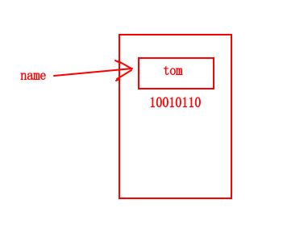
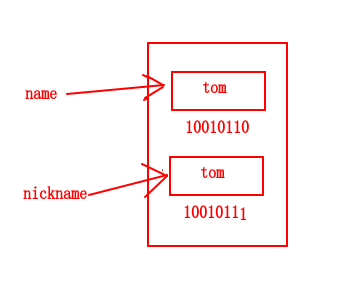
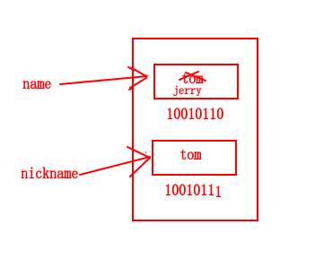
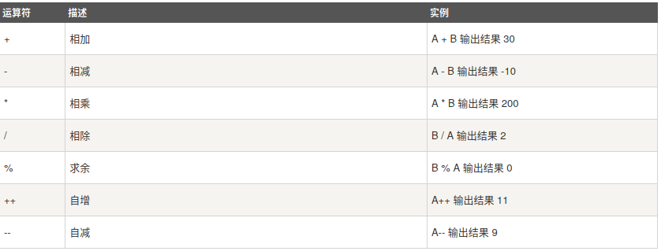
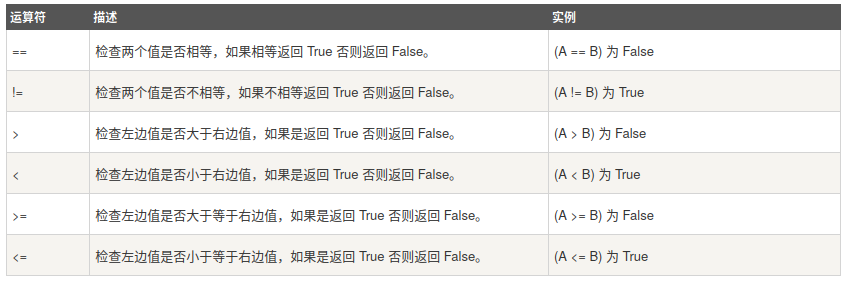
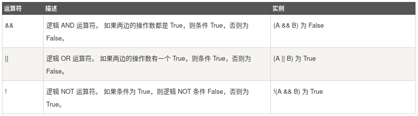
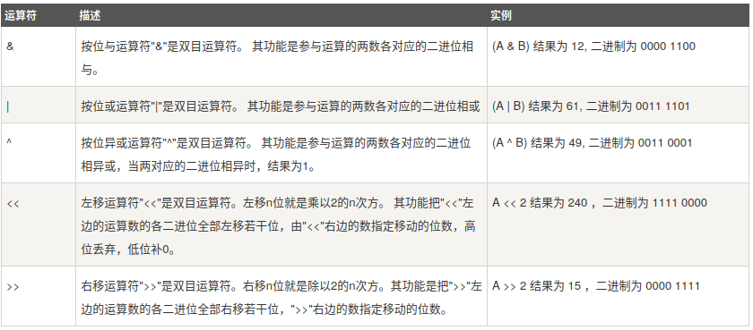
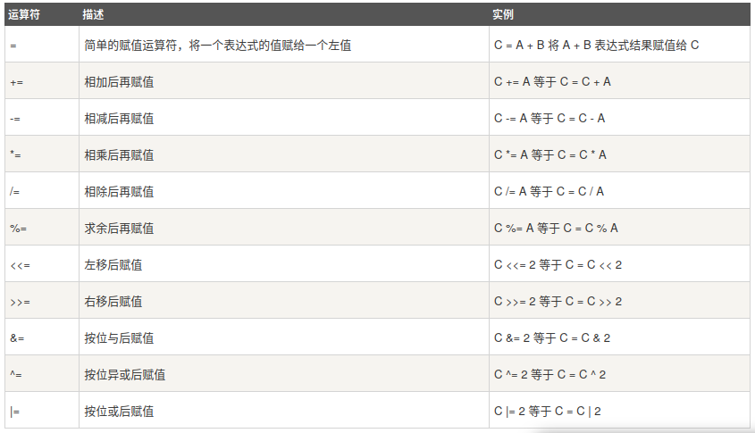
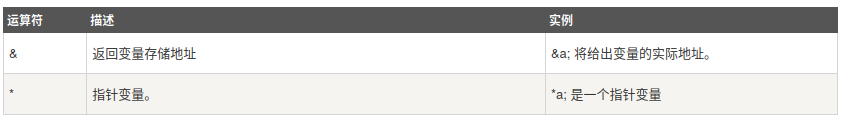
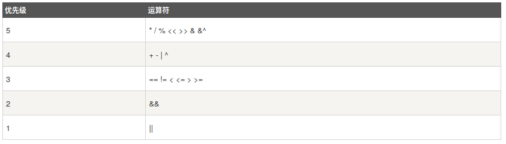

# 简介

go是编译型语言。

编译型：等同于全文翻译，代码写完，通过编译器翻译成可执行文件.c,c++,golang,java

解释型：等同于实时翻译，解释器读一行代码，解释一行，机器执行一行。python,php,javascript,ruby

## 环境搭建

### 1. 安装golang

https://golang.google.cn/doc/install

下载安装包，解压之后将路径加到PATH中去

```
$ cat ~/.zshrc
# go的安装路径
export GOROOT=/home/mikya/install/go
# 存放bin,pkg,src的路径
export GOPATH=/home/mikya/workspace/go
# GOPATH中的bin目录
export GOBIN=/home/mikya/workspace/go/bin
export PATH=/home/mikya/bin:${GOPATH}/bin:${GOROOT}/bin:${ANDROID_HOME}/tools:${ANDROID_HOME}/build-tools/27.0.3:${ANDROID_HOME}/platform-tools:/home/mikya/install/gradle/gradle-4.6/bin:/home/mikya/bin:${PATH}
```

### 2. 命令简介

go build 生成二进制文件，执行二进制文件即可

go run = go build + 执行二进制。将二进制文件放到临时目录，再执行临时目录中的二进制文件

go install = go build  + 将二进制文件放在GOPATH的bin/pkg目录下。

### 3. 目录结构

```
$GOPATH
|-- bin，存放go install编译生成的可执行文件
|-- pkg，存放go install编译生成的包文件
|-- src，存放go源文件和依赖
```

## 快速上手

### 1. 包管理

- 一个文件夹可称为一个包

- 一个包中可以创建多个文件

- 在同一个包下的文件中必须使用package指定包名且包名是相同的。package指定的包名通常都是和外面的文件夹相同，但也可以不同。

**包分类：**

- main包：main包中必须有main()函数，这个main包中的main函数是程序的总入口。编译的就是一个可执行文件
- 非main包：用来对代码进行分类，分别放在不同的包和文件中。

### 2. 输出

内置函数，官方声明有删除下面函数的可能:

- print

- println

fmt包,推荐:

- fmt.Print

- fmt.Println
- fmt.Printf

### 3. 注释

- 单行注释：//
- 多行注释：/*  */

## 变量

### 1. 变量名

- 包含字母、数字、下划线，数字不能开头，由于go支持utf-8所以这个字母可以是任何语言的字母；

  ```go
  var 中文变量 = "变量是中文"
  fmt.Println(中文变量)
  ```

- 不能使用go内置关键字；
- 采用驼峰命令，如果这个变量支持外部访问，则首字母应该大写。

### 2. 声明及初始化

- var name type

  声明变量,变量没有赋值的时候，则会默认填充该类型的零值。

  | 类型   | 零值  |
  | ------ | ----- |
  | string | ""    |
  | int    | 0     |
  | bool   | false |

- var name type =  val

  初始化变量

- var name = val

  go可以根据变量值推导变量的类型，所以可以省略type。此种方式适用于对变量类型要求不严格的场景。

- name :=  val

  短命名，等同于var name = val。常用于局部初始化变量的场景。

- var name1,name2,name3 type

  同时声明多个相同类型的变量

- 声明多个不同类型的变量

  ```go
  var (
  	name = "多"
      age = 18
      hobby = "运动"
      gender string //默认值是""
  )
  ```

**==声明的局部变量一定要使用，否则go编译器就报错；全局变量可以声明不使用==**

### 3. 作用域

在{}中定义的变量，只能在{}中使用，其他地方无法使用。查找变量时，从当前{}找，找不到就去上一级找，依次类推，直至找到全局变量。

- 全局变量

  在go文件的最外层中定义的变量，文件中任一位置都可以使用。定义全局变量要**使用var**,不要用短声明的方式。

- 局部变量

  定义在{}中的变量，可以使用任何声明和初始化方式。

### 4. 变量内存分配

```go
name := "tom"
```



```go
name := "tom"
nickname := name
```



```go
name := "tom"
nickname := name
//name重新赋值不会影响nickname
name = "jerry"
```



**注意事项**：

1. 值类型：

   使用int,string,bool数据类型时，遇到变量的赋值会拷贝一份。不会互相影响

2. 引用类型

   修改某个变量将会影响另外的变量

## 常量

常量是不能修改的变量，所以在定义常量的时候要指定常量的值。一般常量都是定义成全局常量。

### 1. 声明及初始化

- const name type = val

- const name = val
- 多个常量

```go
const (
	v1 = 123
    v2 = 456
)
```

### 2. iota

声明常量时的计数器。

```go
const (
	v1 = 1
    v2 = 2
    v3 = 3
    v4 = 4
)

const (
	v1 = iota //0
    v2 //1
    v3 //2
    v4 //3
)

const (
	v1 = iota +2 //2
    v2 //3
    v3 //4
    v4 //5
)

const (
	v1 = iota +2 //2
    _  //3
    v2 //4
    v3 //5
    v4 //6
)
```

## 流程控制

### 1. 条件语句

```go
if 条件 {
    code
} else {
    code
}

if 条件1 {
    code
} else if 条件2 {
    code
} else if 条件3 {
    code
} else {
    code
}

```

### 2. switch

```go
switch 表达式/变量 {
case 1:
    code
case 2:
    code
default:
    code
}
```

**表达式的值和变量的类型要和case后面指定的值类型一致，否则无法比较。**

### 3. for循环

go中只提供了一种循环方式

```go
#无限循环
for {
    fmt.Println("loop")
    time.Sleep(time.Second * 1)
}

for 条件 {
    code
}

//i只能在for循环中使用，因为是在for循环中生命
for i := 0; i < 3; i++ {
	fmt.Println(i)
}
//省略;隔开的第三列
for i := 0; i < 3; {
	fmt.Println(i)
	i++
}
```

### 4. continue

for循环会终止当前循环，开始下一次循环

```go
func main() {
loop:
	for i := 0; i < 3; i++ {
		for j := 1; j < 4; j++ {
			if j == 2 {
                //终止loop所指向的当前循环
				continue loop
			}
			fmt.Println(i, j)
		}
	}
}
```

### 5. break

跳出所在的循环

```
func main() {
loop:
	for i := 0; i < 3; i++ {
		for j := 1; j < 4; j++ {
			if j == 2 {
                //终止loop所指向的循环
				break loop
			}
			fmt.Println(i, j)
		}
	}
}
```

### 6. goto

跳到指定行，并向下执行代码。

```go
func main() {
	var name string = "jerry"
	if name == "tom" {
		goto svip
	} else if name == "jerry" {
		goto vip
	}

	fmt.Println("预约")
vip:
	fmt.Println("排号")
svip:
	fmt.Println("检查")
}
```

## 运算符

### 1. 算术运算符



### 2. 关系运算符



### 3. 逻辑运算符



### 4. 位运算符



**计算机中的存储、运算、网络传输等，实质上都是二进制操作**

```go
//1.按位与，都是1才得1
r1 := 5 & 99 //十进制的1
5  -> 0000101
99 -> 1100011
      0000001 -> 1

//2.按位或,只要有1就得1
r1 := 5 | 99 //十进制的103
5  -> 0000101
99 -> 1100011
      1100111 -> 103

//3.按位异或,两者不一样是才得一
r1 := 5 ^ 99 //十进制的102
5  -> 0000101
99 -> 1100011
      1100110   -> 102

//4. 按位向左或右移动
r1 := 5 << 2 //20
      5 -> 101
向左移动两位 -> 10100 = 20

r1 := 5 >> 1 //2
      5 -> 101
向右移动两位 -> 10 = 2

//5. 比较清除，以上面为基准，当两个都是1的时候，将上面的1置0
r1 := 5 &^ 99 //4
5  -> 0000101
99 -> 1100011
      0000100 = 4
```

### 5.  赋值运算符



### 6. 指针运算符



### 7. 运算符优先级

使用括号来改变优先级



## 